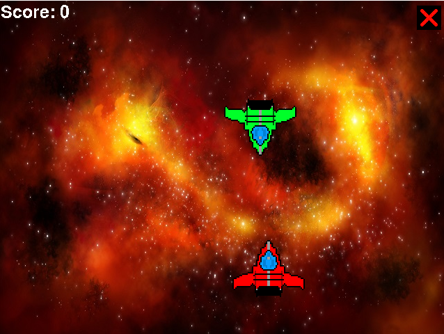

# Space-Mania
This is my first game ever created.

### About
-------------
This isn't a serious project, but more an archive one: Space Mania. My first real game, made in python 3.7.2 with pygame. <brb>
I gotta admit, I had no idea what I was doing back then. It was made 4-5 years ago and it's honestly pretty crap, but oh well, it was my first game.  
That saying, the source code was also very bad, so I decided to spend some time to clean it and comment it. It's not perfect, and it's still all in one file, but I just can't be bothered to bother with this too much.
If you want to improve upon this code, feel free to do so :)

### Getting Started
-------------
To run this project, you will need at least Python 3.7.2 (although the newest Python version works just fine, I tested it). Do not forget you will need the Pygame library (install in terminal or cmd with pip install pygame).   
You're free to modify the project as you wish.

### Credits
-------------
I honestly don't remember where I got these assets from lol  
I probably won't be looking for them anymore, so sorry about the empty section :(

### Preview
-------------

